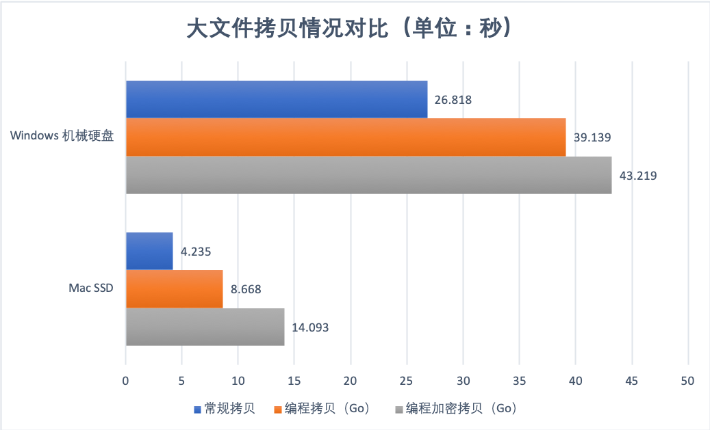
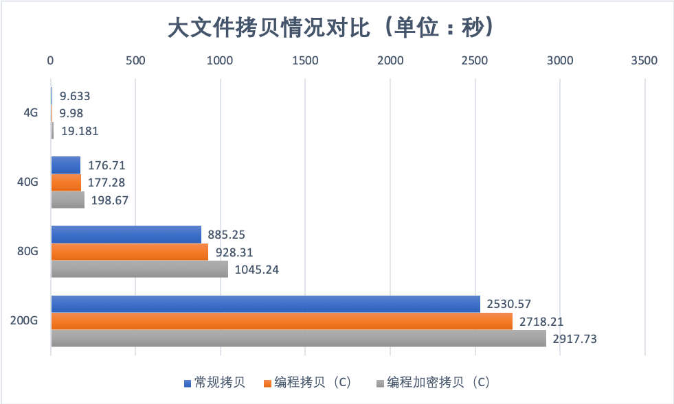

本实验对比常规拷贝、编程拷贝、编程加密拷贝大文件数据的耗时情况。

常规拷贝：Mac（Linux）下使用cp命令、Windows下使用copy命令；

编程拷贝：使用Golang和C语言编写；

编程加密拷贝：使用流密码加密数据，即简单的异或处理；

测试文件：使用随机数生成，head -c bits /dev/urandom > Original；

耗时情况：Mac（Linux）下使用time命令、Windows下使用Powershell的Measure-Command{}。

## 测试结果





详见Excel文件，结论很明显。

## 测试过程

### Golang

程序会生成函数耗时日志timeCost.log，可与命令获取的耗时对比。详见附件源代码main.go、可执行程序copyfile_\*。

目标：4G大小的随机数文件。

环境：Mac SSD、Windows 机械硬盘。

测试过程：

```
1、生成随机化的测试文件
使用随机设备生成4G大小的测试文件。
[zzz]: ~/Downloads/Test4GFileCopySpeed
➜  head -c 4294967296 /dev/urandom > Original
[zzz]: ~/Downloads/Test4GFileCopySpeed
➜  du -h Original
4.0G	Original
[zzz]: ~/Downloads/Test4GFileCopySpeed
➜  head -n 5 Original | hexdump -C
00000000  db 24 1f 7b c5 7c 57 01  93 24 c9 e3 07 23 2f fe  |.$.{.|W..$...#/.|
00000010  4e 6d 89 61 ed 37 88 b2  80 14 86 42 c6 fa 46 b3  |Nm.a.7.....B..F.|
00000020  68 98 b7 e7 34 e3 35 b1  f4 f9 d5 fe df 3b dd d4  |h...4.5......;..|
00000030  38 70 c7 32 ca f0 d1 fb  74 6c 0d 31 01 5f ba e5  |8p.2....tl.1._..|
00000040  9b 34 2a 38 ec ce 47 84  2d a1 fd 89 3b 5f 33 4b  |.4*8..G.-...;_3K|
00000050  e2 bd d4 57 c2 b7 62 f1  32 13 76 db e6 20 27 d1  |...W..b.2.v.. '.|
00000060  df 6b 73 45 57 8f cd 41  f1 a7 42 a9 ae 4c c4 f0  |.ksEW..A..B..L..|

2、程序参数说明
使用-h参数查看帮助文档
[zzz]: ~/Downloads/Test4GFileCopySpeed
➜  ./copyfile -h
Usage of ./copyfile:
  -k string
    	Input Secret Key
  -m int
    	0 -> StreamCipherCrypto
    	1 -> CopyBigFile (default 1)
  -n int
    	Input Buffer Size (default 4096)
  -o string
    	Input Original File
  -t string
    	Input Target File
消耗时间日志：timeCost.log
Selected Mode: General Copy -->	Time Cost: 7.920497753s
Selected Mode: Stream Cipher Crypto -->	Time Cost: 15.672217037s

3、Mac SSD 常规拷贝
[zzz]: ~/Downloads/Test4GFileCopySpeed
➜  time cp Original Target
cp Original Target  0.01s user 2.42s system 57% cpu 4.235 total

4、Mac SSD 编程拷贝
[zzz]: ~/Downloads/Test4GFileCopySpeed
➜  time ./copyfile -o Original -t Target -m 1 -n 4096
./copyfile -o Original -t Target -m 1 -n 4096  1.05s user 7.01s system 92% cpu 8.668 total

5、Mac SSD 编程加密拷贝
[zzz]: ~/Downloads/Test4GFileCopySpeed
➜  time ./copyfile -o Original -t Target -m 0 -n 4096 -k "thisiskey"
./copyfile -o Original -t Target -m 0 -n 4096 -k "thisiskey"  7.07s user 6.43s system 95% cpu 14.093 tota

6、Windows 机械硬盘 常规拷贝
PS C:\Users\zzz\Desktop> Measure-Command {cp Original Target}
Days              : 0
Hours             : 0
Minutes           : 0
Seconds           : 26
Milliseconds      : 818
Ticks             : 268184081
TotalDays         : 0.000310398241898148
TotalHours        : 0.00744955780555556
TotalMinutes      : 0.446973468333333
TotalSeconds      : 26.8184081
TotalMilliseconds : 26818.4081

7、Windows 机械硬盘 编程拷贝
PS C:\Users\zzz\Desktop> Measure-Command {.\copyfile.exe -o .\Original -t Target -m 1 -n 4096}
Days              : 0
Hours             : 0
Minutes           : 0
Seconds           : 39
Milliseconds      : 139
Ticks             : 391399173
TotalDays         : 0.000453008302083333
TotalHours        : 0.01087219925
TotalMinutes      : 0.652331955
TotalSeconds      : 39.1399173
TotalMilliseconds : 39139.9173

8、Windows 机械硬盘 编程加密拷贝
PS C:\Users\zzz\Desktop> Measure-Command {.\copyfile.exe -o .\Original -t Target -m 0 -k "thisiskey" -n 4096}
Days              : 0
Hours             : 0
Minutes           : 0
Seconds           : 43
Milliseconds      : 219
Ticks             : 432198930
TotalDays         : 0.000500230243055556
TotalHours        : 0.0120055257333333
TotalMinutes      : 0.72033155
TotalSeconds      : 43.219893
TotalMilliseconds : 43219.849

9、切片大小影响对比
主要是-n参数，控制切片大小，受内存大小影响。例子使用8192bit切片大小数据。
[zzz]: ~/Downloads/Test4GFileCopySpeed
➜  time ./copyfile -o Original -t Target -m 1 -n 8192
./copyfile -o Original -t Target -m 1 -n 8192  0.56s user 1.45s system 56% cpu 3.557 total
```

### C

目标：4G、40G、80G、200G大小的随机数文件。

环境：Mac+海康威视的SSD。

测试过程：

```
1、4G数据
[zzz]: /Volumes/HIKVISION
➜  time cp Original Target
cp Original Target  0.02s user 3.21s system 33% cpu 9.633 total
[zzz]: /Volumes/HIKVISION
➜  time ./copyFileTest 0 Original Target
./copyFileTest 0 Original Target  1.04s user 5.59s system 66% cpu 9.980 total
[zzz]: /Volumes/HIKVISION
➜  time ./copyFileTest 1 Original Target thisiskey
./copyFileTest 1 Original Target thisiskey  13.48s user 4.82s system 95% cpu 19.181 total

2、40G数据
[zzz]: /Volumes/HIKVISION
➜  head -c 42949672960 /dev/urandom > Original
[zzz]: /Volumes/HIKVISION
➜  du -h Original
 40G	Original
[zzz]: /Volumes/HIKVISION
➜  time cp Original Target
cp Original Target  0.21s user 43.76s system 24% cpu 2:56.31 total
[zzz]: /Volumes/HIKVISION
➜  time ./copyFileTest 0 Original Target
./copyFileTest Original Target  12.91s user 75.67s system 49% cpu 2:57.28 total
[zzz]: /Volumes/HIKVISION
➜  time ./copyFileTest 1 Original Target thisiskey
./copyFileTest_e Original Target thisiskey  551.14s user 58.68s system 98% cpu 10:20.66 total

3、80G数据
[zzz]: /Volumes/HIKVISION
➜  head -c 85899345920 /dev/urandom > Original                                                                                                     [zzz]: /Volumes/HIKVISION
➜  du -h Original
 80G	Original
[zzz]: /Volumes/HIKVISION
➜  time cp Original Target
cp Original Target  0.46s user 95.21s system 8% cpu 14:45.25 total
[zzz]: /Volumes/HIKVISION
➜  time ./copyFileTest 0 Original Target
恭喜你，文件[Original]拷贝成功，保存在[Target]。
./copyFileTest 0 Original Target  27.86s user 161.86s system 20% cpu 15:28.31 total
[zzz]: /Volumes/HIKVISION
➜  time ./copyFileTest 1 Original Target thisiskey
恭喜你，文件[Original]加密成功，保存在[Target]。
./copyFileTest 1 Original Target thisiskey  302.29s user 126.67s system 41% cpu 17:25.24 total

4、200G数据
[zzz]: /Volumes/HIKVISION
➜  head -c 214748364800 /dev/urandom > Original
[zzz]: /Volumes/HIKVISION
➜  du -h Original
200G	Original
[zzz]: /Volumes/HIKVISION
➜  time cp Original Target
cp Original Target  0.95s user 215.42s system 8% cpu 42:10.57 total
[zzz]: /Volumes/HIKVISION
➜  time ./copyFileTest 0 Original Target
恭喜你，文件[Original]拷贝成功，保存在[Target]。
./copyFileTest 0 Original Target  64.23s user 390.17s system 16% cpu 45:18.21 total
[zzz]: /Volumes/HIKVISION
➜  time ./copyFileTest 1 Original Target thisiskey
恭喜你，文件[Original]加密成功，保存在[Target]。
./copyFileTest 1 Original Target thisiskey  747.91s user 349.37s system 37% cpu 48:37.73 total
```

